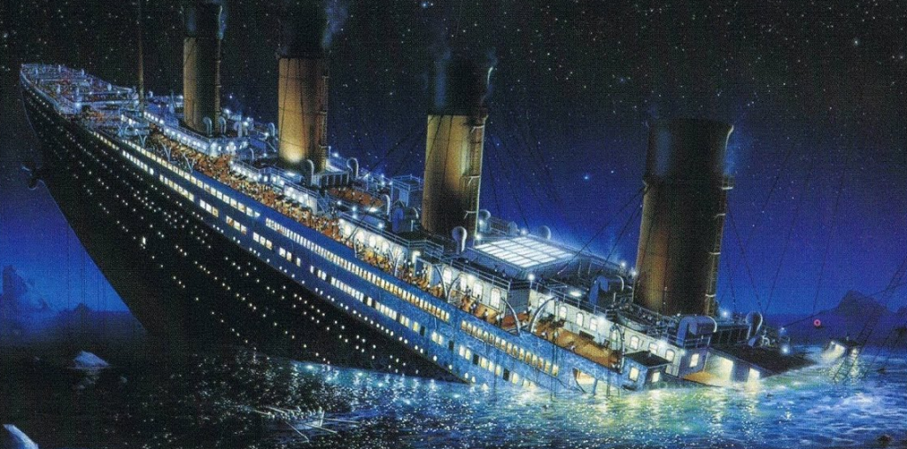

# Titanic Survival

Essential Machine Learning Classification Coding Tutorials

Could you predict which passengers would survive the Titanic?

This is a classic classification problem, and we will use this problem to explore methods of machine learning, from logistic regression and Random Forests through to ‘Deep Learning’ using TensorFlow and PyTorch. Along the way we’ll look at processing data, how to run replicates, measuring accuracy, avoiding over-fitting with regularisation, trading off false positives and false negatives, feature selection and expansion, finding out how much data you need, optimising model parameters, dealing with imbalanced data, and more!

These examples will use Kaggle’s Titanic Survival data to explore machine learning. The Kaggle page may be found at: https://www.kaggle.com/c/titanic.

All examples have links to Jupyter Notebooks. The aim of these notebooks is not to give in-depth description of the methods, but to show what general methods should be employed when investigating/developing a machine-learning model, and to give working examples that may be used as the basis of further exploration.
